# Customer API

API RESTful para gestão de clientes desenvolvida em Go utilizando o framework Gin.

Este projeto foi desenvolvido como uma tarefa da `Pós Graduação em Arquitetura de Software e Inteligência Artificial` ministrado pela `XPEducação`.


## Descrição


Esta API fornece endpoints para realizar operações CRUD (Criar, Ler, Atualizar, Deletar) em registros de clientes. Ela também inclui funcionalidades para buscar clientes por nome e contar o número total de clientes cadastrados. A API utiliza PostgreSQL como banco de dados e Viper para gerenciamento de configurações. A documentação da API é gerada automaticamente usando Swagger.


## Funcionalidades


*   **Criar Cliente:** Adiciona um novo cliente ao sistema.
*   **Buscar Cliente por ID:** Retorna os dados de um cliente específico.
*   **Listar Todos os Clientes:** Retorna uma lista com todos os clientes cadastrados.
*   **Buscar Clientes por Nome:** Retorna uma lista de clientes que correspondem a um nome específico.
*   **Atualizar Cliente:** Modifica os dados de um cliente existente.
*   **Excluir Cliente:** Remove um cliente do sistema.
*   **Contar Clientes:** Retorna o número total de clientes cadastrados.
*   **Health Check:** Endpoint para verificar a saúde da aplicação.
*   **Logging:** Middleware para registrar informações sobre as requisições HTTP.
*   **Documentação Swagger:** Documentação interativa da API.


## Tecnologias Utilizadas


*   **Go:** Linguagem de programação principal.
*   **Gin:** Framework web para Go.
*   **PostgreSQL:** Banco de dados relacional.
*   **GORM:** ORM para Go
*   **Viper:** Gerenciamento de configurações via variáveis de ambiente.
*   **Swagger:** Documentação da API.
*   **Go Playground Validator:** Validação de dados de entrada.


## Pré-requisitos


*   Go (versão 1.24.2 ou superior recomendada)
*   PostgreSQL (pode ser executado localmente ou via Docker)
*   Git


## Estrutura de Pastas (Padrão MVC)


```bash
/customer-api
  /cmd
    /api
      main.go              # Ponto de entrada da aplicação
  /internal
    /config
      config.go            # Configurações da aplicação
    /domain
      /model
        customer.go        # Modelo de dados do cliente
      /repository
        customer_repo.go   # Interface do repositório
        postgres_repo.go   # Implementação do repositório com PostgreSQL
      /service
        customer_service.go # Lógica de negócios
    /handler
      customer_handler.go  # Controladores da API REST
    /middleware
      logging.go           # Middleware para logging
      auth.go              # Middleware para autenticação (opcional)
    /utils
      error.go            # Utilitários para tratamento de erros
  /pkg
    /database
      postgres.go         # Conexão com o banco de dados
  /docs
    swagger.yaml          # Documentação da API (opcional)
  docker-compose.yml      # Configuração Docker
  Dockerfile              # Para containerização
  go.mod                  # Gerenciamento de dependências
  go.sum                  # Checksum das dependências
  README.md               # Documentação
```


## Estrutura de Pastas e Componentes Principais


### 1. Padrão MVC no Contexto da API


- **Model (Modelo)**: Representado pelos arquivos na pasta `/internal/domain/model` - define a estrutura de dados do cliente e suas validações.

- **View**: Em APIs RESTful, a "View" é substituída pela resposta JSON enviada ao cliente.

- **Controller**: Representado pelos handlers na pasta `/internal/handler` - recebe as requisições HTTP, chama os serviços adequados e formata as respostas.


### 2. Componentes Principais


- **Repositório**: Responsável pela persistência de dados, encapsula todas as operações de banco de dados.

- **Serviço**: Contém a lógica de negócios, validações e regras da aplicação.

- **Handler**: Gerencia as requisições HTTP, rotas e formata as respostas.

- **Middleware**: Funções executadas antes ou depois dos handlers para tarefas como logging e autenticação.

- **Config**: Configurações globais da aplicação.

- **Utils**: Funções utilitárias reutilizáveis.


## Arquitetura (Diagramas C4)


Para visualizar a arquitetura da Customer API, foi utilizado o modelo C4, que descreve o sistema em diferentes níveis de abstração: Contexto, Contêineres e Componentes. Os diagramas correspondentes estão localizados na pasta `diagramas/` e foram gerados utilizando o **PlantUML**.


### Nível 1: Diagrama de Contexto do Sistema


Este diagrama mostra a API Customer (`Customer API`) como uma "caixa preta" e como ela se integra ao ambiente, interagindo com usuários e outros sistemas externos.

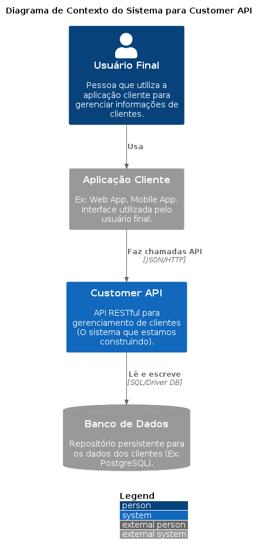

**Elementos Principais:**

*   **Sistema Principal:** `Customer API` - O sistema que está sendo construído, responsável pelo gerenciamento de clientes.
*   **Usuários/Personas:**
    *   `Usuário Final`: Interage com o sistema indiretamente, através de uma aplicação cliente.

*   **Sistemas Externos:**
    *   `Aplicação Cliente` (Ex: Web App, Mobile App): Consome a `Customer API` para realizar operações CRUD de clientes (via requisições HTTP/REST).
    *   `Banco de Dados` (Ex: PostgreSQL): Sistema onde a `Customer API` persiste e recupera os dados dos clientes.

**Interações Chave:**

1.  O `Usuário Final` utiliza a `Aplicação Cliente`.
2.  A `Aplicação Cliente` envia requisições (criar, ler, atualizar, deletar clientes) para a `Customer API`.
3.  A `Customer API` interage com o `Banco de Dados` para ler e gravar informações dos clientes.

Este diagrama de contexto ajuda a entender o escopo do sistema `Customer API` e suas principais dependências externas.


### Nível 2: Diagrama de Contêiner


Este diagrama detalha as partes principais e separadamente implantáveis/executáveis do sistema `Customer API`. Ele "amplia" a caixa preta do diagrama de contexto, mostrando os blocos de construção de alto nível.


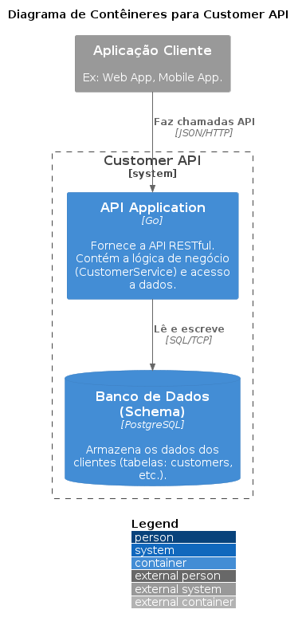


**Contêineres Principais:**

*   **`API Application (Go)`**: A aplicação web/serviço construída em Go que expõe a API RESTful. É o contêiner principal que executa a lógica de negócios (`Customer Service`), lida com as requisições HTTP (`Customer Handler`) e interage com o banco de dados através da camada de repositório.

*   **`Database (PostgreSQL)`**: O servidor de banco de dados onde os dados dos clientes são efetivamente armazenados e gerenciados. A `API Application` interage diretamente com este contêiner para persistir e recuperar dados.

**Sistemas Externos (Interagindo com os Contêineres):**

*   **`Aplicação Cliente`**: Aplicação externa (Web, Mobile, outro serviço) que consome a `API Application` enviando requisições.

*   **`Usuário Final`**: Pessoa que utiliza a `Aplicação Cliente` para interagir indiretamente com a `Customer API`.

**Interações Chave:**

1.  A `Aplicação Cliente` envia requisições HTTP/JSON para a `API Application (Go)` (ex: para criar um novo cliente).

2.  A `API Application (Go)` processa a requisição, aplica a lógica de negócio necessária e executa operações (ex: comandos SQL via GORM) no `Database (PostgreSQL)` através de uma conexão da rede.

3.  O `Database (PostgreSQL)` armazena ou recupera os dados solicitados e retorna o resultado para a `API Application`.

4.  A `API Application (Go)` formata a resposta e a envia de volta para a `Aplicação Cliente`.

Este diagrama ajuda a entender a arquitetura de alto nível em termos de processos ou unidades de implantação e como eles se comunicam entre si e com sistemas externos.


### Nível 3: Diagrama de Componentes


Este diagrama decompõe o contêiner `API Application (Go)` em seus principais blocos de construção lógicos ou módulos, mostrando como eles colaboram para entregar as funcionalidades da API de gerenciamento de clientes.

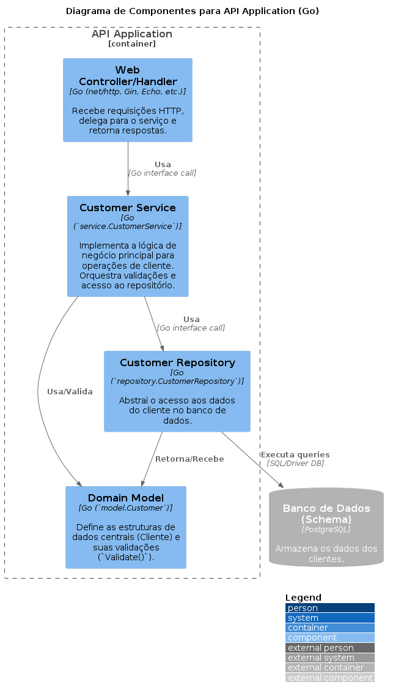


**Componentes Principais dentro da `API Application (Go)`:**

*   **`Customer Handler (Gin)`**: Localizado em `internal/handler`, este componente é responsável por:
    *   Receber as requisições HTTP que chegam através do framework Gin.
    *   Extrair dados das requisições (parâmetros de rota, query strings, corpo JSON).
    *   Realizar validações básicas de entrada.
    *   Chamar os métodos apropriados do `Customer Service` para processar a requisição.
    *   Formatar as respostas (sucesso ou erro) em JSON e enviá-las de volta ao cliente.

*   **`Customer Service`**: Localizado em `internal/domain/service`, este componente encapsula a lógica de negócios principal:
    *   Orquestra as operações de gerenciamento de clientes (criar, buscar, atualizar, deletar, contar).
    *   Aplica regras de negócio e validações mais complexas (utilizando o `Domain Model`).
    *   Interage com o `Customer Repository` para persistir e recuperar dados.

*   **`Customer Repository (GORM)`**: Localizado em `internal/domain/repository`, este componente abstrai o acesso aos dados:
    *   Implementa a interface `CustomerRepository`.
    *   Traduz as operações de domínio (ex: `GetByID`, `Create`) em operações específicas do banco de dados (ex: comandos SQL executados via GORM).
    *   Interage diretamente com o contêiner `Database (PostgreSQL)`.

*   **`Domain Model (Customer)`**: Localizado em `internal/domain/model`, define as estruturas de dados centrais:
    *   Representa a entidade `Customer` com seus atributos.
    *   Inclui métodos de validação (`Validate()`) para garantir a integridade dos dados.

**Interações Chave:**

1.  O `Customer Handler` recebe uma requisição HTTP e chama um método no `Customer Service` (ex: `CreateCustomer`).

2.  O `Customer Service` utiliza o `Domain Model` para validar os dados recebidos (ex: chamando `customer.Validate()`).

3.  O `Customer Service` chama o método correspondente no `Customer Repository` (ex: `repo.Create(customer)`).

4.  O `Customer Repository` executa a operação no `Database (PostgreSQL)` usando GORM.

5.  O resultado (ou erro) é retornado pela cadeia: Repositório -> Serviço -> Handler.

6.  O `Customer Handler` envia a resposta final ao cliente.

Este diagrama ajuda a entender a estrutura interna da aplicação e como as diferentes responsabilidades são separadas em componentes coesos, facilitando a manutenção e evolução do código.


### Nível 4: Código (Code)


Este diagrama ilustra a arquitetura e as dependências entre os principais componentes do projeto `customer-api`. Ele segue uma estrutura de pacotes comum em projetos Go, separando responsabilidades como configuração, domínio (modelo, repositório, serviço), handlers HTTP, middlewares e utilitários. 

A seguir está o diagrama de dependencias e os pocotes e componentes serão detalhados logo a seguir:


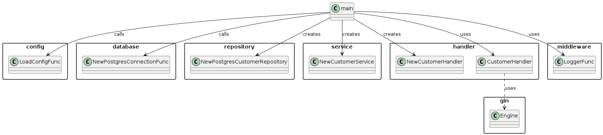


#### Explicação dos Pacotes e Componentes

*   **`cmd/api`**: Contém o ponto de entrada da aplicação (`main`).
    *   `main`: Responsável pela inicialização: carrega configurações, estabelece conexão com o banco, cria instâncias dos serviços, repositórios e handlers, injeta as dependências e inicia o servidor HTTP (usando Gin).


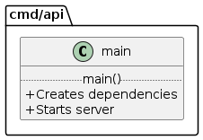


*   **`internal/config`**: Gerencia a configuração da aplicação.
    *   `Config`: Struct que armazena os valores de configuração (portas, credenciais de DB, etc.).
    *   `LoadConfig()`: Função que lê as configurações (de arquivos ou variáveis de ambiente usando `viper`) e retorna um ponteiro para `Config`.


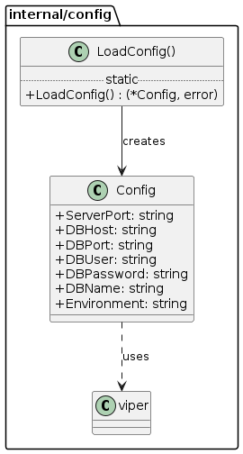


*   **`internal/domain`**: Contém a lógica central e as regras de negócio.
    *   **`model`**: Define as estruturas de dados do domínio.
        *   `Customer`: Representa a entidade Cliente com seus atributos e validações (`Validate()`, que usa `validator.v10`).
    *   **`repository`**: Define a camada de abstração para acesso a dados.
        *   `CustomerRepository` (Interface): Contrato para operações de persistência de `Customer`.
        *   `postgresCustomerRepository`: Implementação concreta de `CustomerRepository` usando PostgreSQL e `GORM`. Depende de `*gorm.DB` e `model.Customer`.
    *   **`service`**: Contém a lógica de negócio e orquestração.
        *   `CustomerService` (Interface): Contrato para as operações de negócio relacionadas a `Customer`.
        *   `customerService`: Implementação de `CustomerService`. Utiliza `CustomerRepository` para interagir com os dados e aplica regras de negócio.


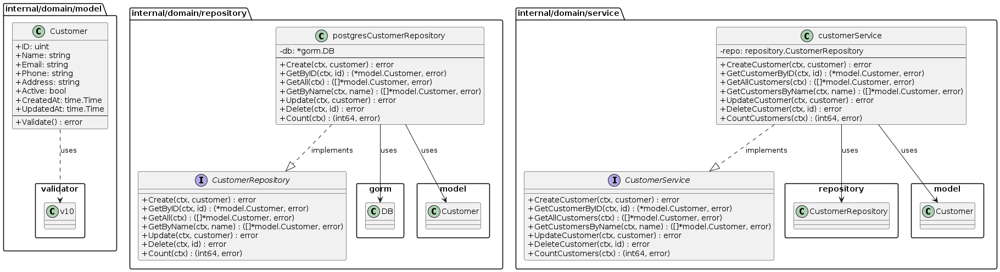


*   **`internal/handler`**: Responsável por lidar com as requisições HTTP e respostas.
    *   `CustomerHandler`: Recebe requisições HTTP (via `gin.Context`), interage com `CustomerService`, e formata/envia respostas JSON (usando `model.Customer`, `utils.ErrorResponse`, `utils.CountResponse`). Registra as rotas no `gin.Engine`.


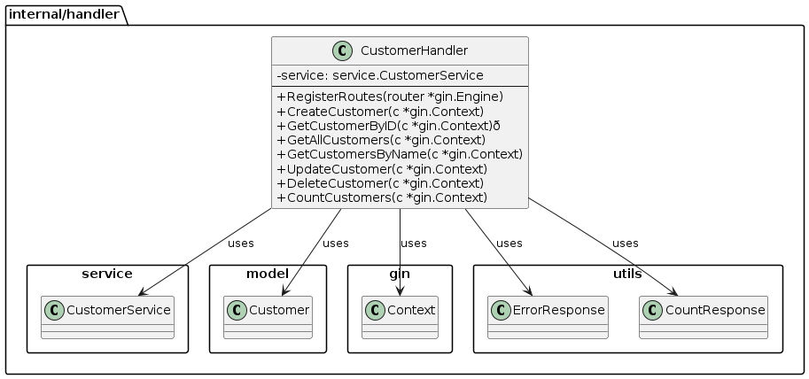


*   **`internal/middleware`**: Contém middlewares HTTP.
    *   `Logger()`: Função que retorna um `gin.HandlerFunc` para logging de requisições.


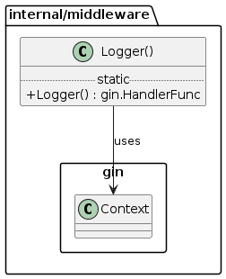


*   **`internal/utils`**: Pacote para funções e tipos utilitários.
    *   `ErrorResponse`, `CountResponse`: Structs para padronizar respostas JSON.


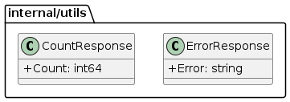


*   **`pkg/database`**: Utilitários relacionados ao banco de dados (fora do `internal` pois pode ser potencialmente reutilizável).
    *   `NewPostgresConnection()`: Função que recebe `*config.Config` e estabelece a conexão com o banco de dados, retornando `*gorm.DB`.


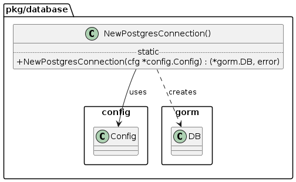


### Principais Fluxos e Dependências


1.  **Inicialização (`main`)**: `main` orquestra a criação de todas as dependências: chama `LoadConfig`, `NewPostgresConnection`, e os construtores (assumidos como `New...`) para `postgresCustomerRepository`, `customerService`, e `CustomerHandler`.

2.  **Injeção de Dependência**: As dependências são injetadas de fora para dentro: `*gorm.DB` no repositório, `CustomerRepository` no serviço, `CustomerService` no handler.

3.  **Requisição HTTP**: Uma requisição chega ao `gin.Engine`, é interceptada por middlewares (`Logger`), e direcionada para um método do `CustomerHandler`.

4.  **Processamento**: O `CustomerHandler` delega a lógica para o `CustomerService`, que por sua vez utiliza o `CustomerRepository` para interagir com o banco de dados. O `CustomerService` também pode usar o `model.Customer` para validações.

5.  **Resposta**: O `CustomerHandler` recebe o resultado do serviço e envia uma resposta JSON apropriada.

Este diagrama fornece uma visão clara da separação de responsabilidades e do fluxo de dependências na aplicação, seguindo princípios de arquitetura limpa e modularidade.


## Como Executar Localmente


1.  **Clone o repositório:**

    ```bash
    
    git clone https://github.com/wandermaia/customer-api.git
    
    cd customer-api
    
    ```

2.  **Configure as Variáveis de Ambiente:**

    Crie um arquivo `.env` na raiz do projeto (ou configure as variáveis diretamente no seu ambiente) com as seguintes informações:

    ```dotenv
    
    SERVER_PORT=8080
    DB_HOST=localhost
    DB_PORT=5432
    DB_USER=postgres
    DB_PASSWORD=postgres
    DB_NAME=customer_db
    ENVIRONMENT=development # ou production
    
    ```
    *Certifique-se de que o banco de dados `customer_db` exista no seu servidor PostgreSQL.*

3.  **Instale as dependências:**
    
    ```bash
    
    go mod tidy
    
    ```

4.  **Execute a Aplicação:**
    
    ```bash
    
    go run cmd/api/main.go
    
    ```
    O servidor será iniciado na porta especificada (padrão: 8080).

5.  **Acesse a API:** Após a inicialização, a API estará disponível em `http://localhost:8080`.

6.  **Acesse a documentação Swagger:** A documentação gerada pelo Swaggo geralmente fica disponível em `http://localhost:8080/swagger/index.html` (verifique a configuração específica do seu router Go se este caminho não funcionar).


## Como Executar Localmente com Docker


1.  **Clone o repositório:**

    ```bash
    
    git clone https://github.com/wandermaia/customer-api.git
    
    cd customer-api
    
    ```

2.  **Execute o comando para construir a imagem e iniciar os containers:**
    
    ```bash

    docker-compose up --build -d
    
    ```
    O servidor será iniciado na porta especificada (padrão: 8080).

3.  **Acesse a API:** Após a inicialização, a API estará disponível em `http://localhost:8080`.


4.  **Acesse a documentação Swagger:** A documentação gerada pelo Swaggo geralmente fica disponível em `http://localhost:8080/swagger/index.html` (verifique a configuração específica do seu router Go se este caminho não funcionar).


## Endpoints da API


A base URL para a API é `/api`.

| Método   | Path                 | Descrição                             |
| :------- | :------------------- | :------------------------------------ |
| `POST`   | `/customers`         | Cria um novo cliente.                 |
| `GET`    | `/customers`         | Lista todos os clientes.              |
| `GET`    | `/customers/count`   | Retorna o número total de clientes.   |
| `GET`    | `/customers/{id}`    | Busca um cliente pelo ID.             |
| `GET`    | `/customers/search`  | Busca clientes pelo nome (`?name=...`). |
| `PUT`    | `/customers/{id}`    | Atualiza um cliente existente.        |
| `DELETE` | `/customers/{id}`    | Exclui um cliente.                    |


### Testes de funcionalidade da API


Para a realização dos testes funcionais foi criado um arquivo http no caminho `test/customer.http`, permitindo a execução dos testes dentro do próprio **VScode**, através da extensão `REST Client`.


### Documentação Swagger


Após iniciar a aplicação, a documentação interativa da API estará disponível em:
`http://localhost:<SERVER_PORT>/swagger/index.html` (substitua `<SERVER_PORT>` pela porta configurada, ex: 8080).


## Configuração


A aplicação utiliza variáveis de ambiente para configuração. As seguintes variáveis são suportadas (veja `internal/config/config.go`):

*   `SERVER_PORT`: Porta onde a API será executada (padrão: `8080`).
*   `DB_HOST`: Host do banco de dados PostgreSQL.
*   `DB_PORT`: Porta do banco de dados PostgreSQL.
*   `DB_USER`: Usuário do banco de dados.
*   `DB_PASSWORD`: Senha do banco de dados.
*   `DB_NAME`: Nome do banco de dados.
*   `ENVIRONMENT`: Ambiente de execução (`development` ou `production`, padrão: `development`).


## Testes

Para executar os testes automatizados, basta executar o seguinte comando a partir da raiz do projeto:

```bash

go test ./...

```


## Geração de Mocks e Execução de Testes

Este projeto utiliza `gomock` e `mockgen` para criar objetos mockados das interfaces (como `CustomerRepository` e `CustomerService`), permitindo testes de unidade isolados para as camadas de serviço e handler.

### 1. Instalação do Mockgen

Se você ainda não tem o `mockgen` instalado, execute o seguinte comando:

```bash

go install go.uber.org/mock/mockgen@latest

```
Isso instalará o executável mockgen no seu `$GOPATH/bin` ou `$HOME/go/bin`. Certifique-se de que este diretório esteja no seu **PATH**.


### 2. Geração dos Mocks


Os mocks são gerados a partir das interfaces definidas no domínio. Para gerar (ou regenerar) os mocks necessários para os testes, execute os seguintes comandos a partir da raiz do projeto:

- Mock para `CustomerRepository`:

```bash
mockgen -source=internal/domain/repository/customer_repo.go -destination=internal/domain/repository/mock/mock_customer_repository.go -package=mock_repository

```
- Mock para `CustomerService`:

```bash

mockgen -source=internal/domain/service/customer_service.go -destination=internal/domain/service/mock/mock_customer_service.go -package=mock_service

```

Descrição dos parâmetros utilizados com o comando `mockgen`:

- **-source:** Especifica o arquivo da interface Go que será mockada.
- **-destination:** Define o caminho e o nome do arquivo onde o código do mock será gerado.
- **-package:** Define o nome do pacote para o arquivo de mock gerado.


### 2. Execução dos Testes


Com os mocks gerados, você pode executar todos os testes de unidade do projeto (incluindo os que dependem dos mocks) com o seguinte comando, executado na raiz do projeto:

```bash

go test ./... -v


```

- **./...:** Indica ao Go para executar testes em todos os subdiretórios.

- **-v:** (Opcional) Ativa o modo verbose, mostrando o status de cada teste individualmente.

Isso compilará e executará todos os arquivos _test.go encontrados no projeto, reportando os resultados.


## Referências


Golang Documentation

https://go.dev/doc/


Gin Web Framework

https://gin-gonic.com/


What is Viper?

https://github.com/spf13/viper


Testify - Thou Shalt Write Tests

https://github.com/stretchr/testify


gomock

https://github.com/golang/mock


REST Client

https://marketplace.visualstudio.com/items?itemName=humao.rest-client


The C4 model for visualising software architecture

https://c4model.com/


PlantUML 

https://plantuml.com/


PlantUML (VSCode extension)

https://marketplace.visualstudio.com/items?itemName=jebbs.plantuml
