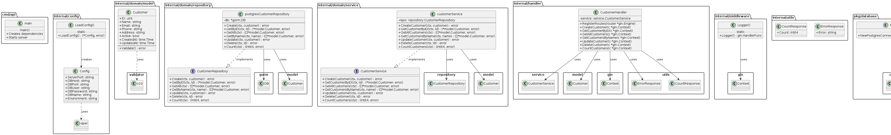

# Customer API

API RESTful para gestão de clientes desenvolvida em Go utilizando o framework Gin.

Este projeto foi desenvolvido como uma tarefa da `Pós Graduação em Arquitetura de Software e Inteligência Artificial` ministrado pela `XPEducação`.

## Descrição

Esta API fornece endpoints para realizar operações CRUD (Criar, Ler, Atualizar, Deletar) em registros de clientes. Ela também inclui funcionalidades para buscar clientes por nome e contar o número total de clientes cadastrados. A API utiliza PostgreSQL como banco de dados e Viper para gerenciamento de configurações. A documentação da API é gerada automaticamente usando Swagger.

## Funcionalidades

*   **Criar Cliente:** Adiciona um novo cliente ao sistema.
*   **Buscar Cliente por ID:** Retorna os dados de um cliente específico.
*   **Listar Todos os Clientes:** Retorna uma lista com todos os clientes cadastrados.
*   **Buscar Clientes por Nome:** Retorna uma lista de clientes que correspondem a um nome específico.
*   **Atualizar Cliente:** Modifica os dados de um cliente existente.
*   **Excluir Cliente:** Remove um cliente do sistema.
*   **Contar Clientes:** Retorna o número total de clientes cadastrados.
*   **Health Check:** Endpoint para verificar a saúde da aplicação.
*   **Logging:** Middleware para registrar informações sobre as requisições HTTP.
*   **Documentação Swagger:** Documentação interativa da API.

## Tecnologias Utilizadas

*   **Go:** Linguagem de programação principal.
*   **Gin:** Framework web para Go.
*   **PostgreSQL:** Banco de dados relacional.
*   **GORM:** ORM para Go
*   **Viper:** Gerenciamento de configurações via variáveis de ambiente.
*   **Swagger:** Documentação da API.
*   **Go Playground Validator:** Validação de dados de entrada.

## Pré-requisitos

*   Go (versão 1.24.2 ou superior recomendada)
*   PostgreSQL (pode ser executado localmente ou via Docker)
*   Git

## Estrutura de Pastas (Padrão MVC)

```bash
/customer-api
  /cmd
    /api
      main.go              # Ponto de entrada da aplicação
  /internal
    /config
      config.go            # Configurações da aplicação
    /domain
      /model
        customer.go        # Modelo de dados do cliente
      /repository
        customer_repo.go   # Interface do repositório
        postgres_repo.go   # Implementação do repositório com PostgreSQL
      /service
        customer_service.go # Lógica de negócios
    /handler
      customer_handler.go  # Controladores da API REST
    /middleware
      logging.go           # Middleware para logging
      auth.go              # Middleware para autenticação (opcional)
    /utils
      error.go            # Utilitários para tratamento de erros
  /pkg
    /database
      postgres.go         # Conexão com o banco de dados
  /docs
    swagger.yaml          # Documentação da API (opcional)
  docker-compose.yml      # Configuração Docker
  Dockerfile              # Para containerização
  go.mod                  # Gerenciamento de dependências
  go.sum                  # Checksum das dependências
  README.md               # Documentação
```

## Explicação da Estrutura de Pastas e Componentes


### 1. Padrão MVC no Contexto da API


- **Model (Modelo)**: Representado pelos arquivos na pasta `/internal/domain/model` - define a estrutura de dados do cliente e suas validações.

- **View**: Em APIs RESTful, a "View" é substituída pela resposta JSON enviada ao cliente.

- **Controller**: Representado pelos handlers na pasta `/internal/handler` - recebe as requisições HTTP, chama os serviços adequados e formata as respostas.


### 2. Componentes Principais


- **Repositório**: Responsável pela persistência de dados, encapsula todas as operações de banco de dados.

- **Serviço**: Contém a lógica de negócios, validações e regras da aplicação.

- **Handler**: Gerencia as requisições HTTP, rotas e formata as respostas.

- **Middleware**: Funções executadas antes ou depois dos handlers para tarefas como logging e autenticação.

- **Config**: Configurações globais da aplicação.

- **Utils**: Funções utilitárias reutilizáveis.


## Arquitetura (Diagramas C4)


Para visualizar a arquitetura da Customer API, foi utilizado o modelo C4, que descreve o sistema em diferentes níveis de abstração: Contexto, Contêineres e Componentes. Os diagramas correspondentes estão localizados na pasta `diagramas/` e foram gerados utilizando o **PlantUML**.


### Nível 1: Diagrama de Contexto do Sistema

Este diagrama mostra a API Customer dentro do seu ambiente, interagindo com usuários e outros sistemas.


### Nível 2: Diagrama de Contêiner

Este diagrama detalha os principais blocos de construção da API Customer, como a própria aplicação web/API, o banco de dados, etc.


### Nível 3: Diagrama de Componentes

Este diagrama foca nos componentes internos da aplicação API, mostrando como eles colaboram para realizar as funcionalidades.


### Nível 4: Código (Code)

Este diagrama ilustra a arquitetura e as dependências entre os principais componentes do projeto `customer-api`. Ele segue uma estrutura de pacotes comum em projetos Go, separando responsabilidades como configuração, domínio (modelo, repositório, serviço), handlers HTTP, middlewares e utilitários.




#### Explicação dos Pacotes e Componentes

*   **`cmd/api`**: Contém o ponto de entrada da aplicação (`main`).
    *   `main`: Responsável pela inicialização: carrega configurações, estabelece conexão com o banco, cria instâncias dos serviços, repositórios e handlers, injeta as dependências e inicia o servidor HTTP (usando Gin).

*   **`internal/config`**: Gerencia a configuração da aplicação.
    *   `Config`: Struct que armazena os valores de configuração (portas, credenciais de DB, etc.).
    *   `LoadConfig()`: Função que lê as configurações (de arquivos ou variáveis de ambiente usando `viper`) e retorna um ponteiro para `Config`.

*   **`internal/domain`**: Contém a lógica central e as regras de negócio.
    *   **`model`**: Define as estruturas de dados do domínio.
        *   `Customer`: Representa a entidade Cliente com seus atributos e validações (`Validate()`, que usa `validator.v10`).
    *   **`repository`**: Define a camada de abstração para acesso a dados.
        *   `CustomerRepository` (Interface): Contrato para operações de persistência de `Customer`.
        *   `postgresCustomerRepository`: Implementação concreta de `CustomerRepository` usando PostgreSQL e `GORM`. Depende de `*gorm.DB` e `model.Customer`.
    *   **`service`**: Contém a lógica de negócio e orquestração.
        *   `CustomerService` (Interface): Contrato para as operações de negócio relacionadas a `Customer`.
        *   `customerService`: Implementação de `CustomerService`. Utiliza `CustomerRepository` para interagir com os dados e aplica regras de negócio.

*   **`internal/handler`**: Responsável por lidar com as requisições HTTP e respostas.
    *   `CustomerHandler`: Recebe requisições HTTP (via `gin.Context`), interage com `CustomerService`, e formata/envia respostas JSON (usando `model.Customer`, `utils.ErrorResponse`, `utils.CountResponse`). Registra as rotas no `gin.Engine`.

*   **`internal/middleware`**: Contém middlewares HTTP.
    *   `Logger()`: Função que retorna um `gin.HandlerFunc` para logging de requisições.

*   **`internal/utils`**: Pacote para funções e tipos utilitários.
    *   `ErrorResponse`, `CountResponse`: Structs para padronizar respostas JSON.

*   **`pkg/database`**: Utilitários relacionados ao banco de dados (fora do `internal` pois pode ser potencialmente reutilizável).
    *   `NewPostgresConnection()`: Função que recebe `*config.Config` e estabelece a conexão com o banco de dados, retornando `*gorm.DB`.


### Principais Fluxos e Dependências


1.  **Inicialização (`main`)**: `main` orquestra a criação de todas as dependências: chama `LoadConfig`, `NewPostgresConnection`, e os construtores (assumidos como `New...`) para `postgresCustomerRepository`, `customerService`, e `CustomerHandler`.

2.  **Injeção de Dependência**: As dependências são injetadas de fora para dentro: `*gorm.DB` no repositório, `CustomerRepository` no serviço, `CustomerService` no handler.

3.  **Requisição HTTP**: Uma requisição chega ao `gin.Engine`, é interceptada por middlewares (`Logger`), e direcionada para um método do `CustomerHandler`.

4.  **Processamento**: O `CustomerHandler` delega a lógica para o `CustomerService`, que por sua vez utiliza o `CustomerRepository` para interagir com o banco de dados. O `CustomerService` também pode usar o `model.Customer` para validações.

5.  **Resposta**: O `CustomerHandler` recebe o resultado do serviço e envia uma resposta JSON apropriada.

Este diagrama fornece uma visão clara da separação de responsabilidades e do fluxo de dependências na aplicação, seguindo princípios de arquitetura limpa e modularidade.


## Como Executar Localmente


1.  **Clone o repositório:**

    ```bash
    
    git clone https://github.com/wandermaia/customer-api.git
    
    cd customer-api
    
    ```

2.  **Configure as Variáveis de Ambiente:**

    Crie um arquivo `.env` na raiz do projeto (ou configure as variáveis diretamente no seu ambiente) com as seguintes informações:

    ```dotenv
    
    SERVER_PORT=8080
    DB_HOST=localhost
    DB_PORT=5432
    DB_USER=seu_usuario_db
    DB_PASSWORD=sua_senha_db
    DB_NAME=customer_db
    ENVIRONMENT=development # ou production
    
    ```
    *Certifique-se de que o banco de dados `customer_db` exista no seu servidor PostgreSQL.*

3.  **Instale as dependências:**
    
    ```bash
    
    go mod tidy
    
    ```

4.  **Execute a Aplicação:**
    
    ```bash
    
    go run cmd/api/main.go
    
    ```
    O servidor será iniciado na porta especificada (padrão: 8080).

5.  **Acesse a API:** Após a inicialização, a API estará disponível em `http://localhost:8080`.

6.  **Acesse a documentação Swagger:** A documentação gerada pelo Swaggo geralmente fica disponível em `http://localhost:8080/swagger/index.html` (verifique a configuração específica do seu router Go se este caminho não funcionar).


## Como Executar Localmente com Docker


1.  **Clone o repositório:**

    ```bash
    
    git clone https://github.com/wandermaia/customer-api.git
    
    cd customer-api
    
    ```

2.  **Execute o comando para construir a imagem e iniciar os containers:**
    
    ```bash

    docker-compose up --build -d
    
    ```
    O servidor será iniciado na porta especificada (padrão: 8080).

3.  **Acesse a API:** Após a inicialização, a API estará disponível em `http://localhost:8080`.


4.  **Acesse a documentação Swagger:** A documentação gerada pelo Swaggo geralmente fica disponível em `http://localhost:8080/swagger/index.html` (verifique a configuração específica do seu router Go se este caminho não funcionar).


## Endpoints da API


A base URL para a API é `/api`.

| Método   | Path                 | Descrição                             |
| :------- | :------------------- | :------------------------------------ |
| `POST`   | `/customers`         | Cria um novo cliente.                 |
| `GET`    | `/customers`         | Lista todos os clientes.              |
| `GET`    | `/customers/count`   | Retorna o número total de clientes.   |
| `GET`    | `/customers/{id}`    | Busca um cliente pelo ID.             |
| `GET`    | `/customers/search`  | Busca clientes pelo nome (`?name=...`). |
| `PUT`    | `/customers/{id}`    | Atualiza um cliente existente.        |
| `DELETE` | `/customers/{id}`    | Exclui um cliente.                    |
| `GET`    | `/health`            | Verifica a saúde da aplicação.        |
| `GET`    | `/swagger/*any`      | Acessa a documentação Swagger UI.     |


### Documentação Swagger


Após iniciar a aplicação, a documentação interativa da API estará disponível em:
`http://localhost:<SERVER_PORT>/swagger/index.html` (substitua `<SERVER_PORT>` pela porta configurada, ex: 8080).


## Configuração


A aplicação utiliza variáveis de ambiente para configuração. As seguintes variáveis são suportadas (veja `internal/config/config.go`):

*   `SERVER_PORT`: Porta onde a API será executada (padrão: `8080`).
*   `DB_HOST`: Host do banco de dados PostgreSQL.
*   `DB_PORT`: Porta do banco de dados PostgreSQL.
*   `DB_USER`: Usuário do banco de dados.
*   `DB_PASSWORD`: Senha do banco de dados.
*   `DB_NAME`: Nome do banco de dados.
*   `ENVIRONMENT`: Ambiente de execução (`development` ou `production`, padrão: `development`).


## Referências


Golang Documentation

https://go.dev/doc/


Gin Web Framework

https://gin-gonic.com/


What is Viper?

https://github.com/spf13/viper


The C4 model for visualising software architecture

https://c4model.com/


PlantUML 

https://plantuml.com/


PlantUML (VSCode extension)

https://marketplace.visualstudio.com/items?itemName=jebbs.plantuml
